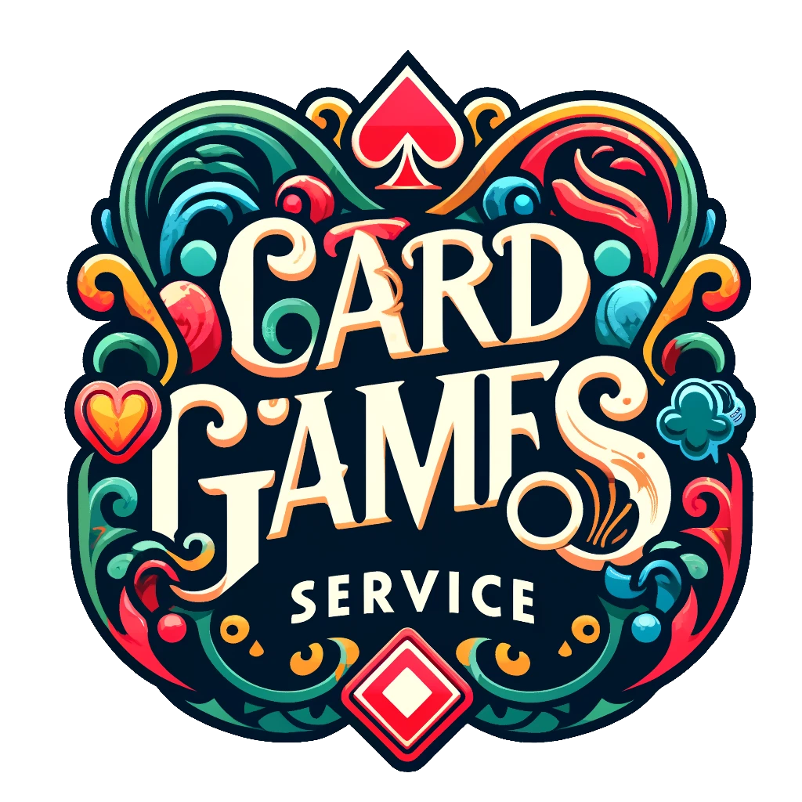

<p align="center">
  
</p>

[](https://pkg.go.dev/github.com/sergiught/card-games-service)
[](https://goreportcard.com/report/github.com/sergiught/card-games-service)
[](https://github.com/sergiught/card-games-service/blob/main/LICENSE)

---

This is a backend service designed to manage and operate various card game functionalities such as deck creation,
shuffling, and drawing cards. This service supports multiple types of card decks, allowing users to customize their card
gaming experience.

It also serves as an example on how to structure, build and test a modern Go API service.

---

## Table of Contents

* [Getting started](#getting-started)
    * [Prerequisites](#prerequisites)
    * [Development](#development)
    * [Testing](#testing)
* [Features](#features)
* [API Documentation](#api-documentation)
* [Next steps](#next-steps)
* [Contributing](#contributing)

--- 

## Getting started

### Prerequisites

- [Go 1.22+](https://go.dev/dl/)
- [Docker](https://www.docker.com/get-started/)

### Development

Run `make dev-run` to start the docker containers and run the service.

### Testing

Run `make test-features` to execute the feature tests that leverage cucumber gherkin formatted scenarios.

To execute the unit tests run `make test-unit`.

## Features

To have a sense of the service features you can take a look at the feature files available under the
[features](features) folder.

- Create a deck
- Open a deck
- Draw cards from a deck

## API Documentation

### POST /decks

<details>
  <summary>Request Schema</summary>

```json
{
  "$schema": "http://json-schema.org/draft-07/schema#",
  "title": "CreateDeckRequest",
  "type": "object",
  "properties": {
    "shuffled": {
      "type": "boolean",
      "description": "Indicates if the deck should be shuffled."
    },
    "deck_type": {
      "type": "string",
      "description": "The type of deck to create, e.g., 'standard' or 'custom'."
    },
    "cards": {
      "type": "array",
      "items": {
        "$ref": "#/definitions/FrenchCard"
      },
      "description": "List of custom cards to include in the deck if deck_type is 'custom'."
    }
  },
  "required": ["deck_type"],
  "definitions": {
    "FrenchCard": {
      "type": "object",
      "properties": {
        "value": {"type": "string"},
        "suit": {"type": "string"},
        "code": {"type": "string"}
      },
      "required": ["value", "suit", "code"]
    }
  }
}
```

</details>

<details>
  <summary>Response Schema</summary>

```json
{
  "$schema": "http://json-schema.org/draft-07/schema#",
  "title": "CreateDeckResponse",
  "type": "object",
  "properties": {
    "deck_id": {
      "type": "string",
      "description": "Unique identifier of the created deck."
    },
    "shuffled": {
      "type": "boolean",
      "description": "Indicates if the deck is shuffled."
    },
    "remaining": {
      "type": "integer",
      "description": "The number of remaining cards in the deck."
    }
  },
  "required": ["deck_id", "shuffled", "remaining"]
}
```

</details>

### GET /decks/:id

<details>
  <summary>Response Schema</summary>

```json
{
  "$schema": "http://json-schema.org/draft-07/schema#",
  "title": "Open Deck Response",
  "type": "object",
  "properties": {
    "deck_id": {
      "type": "string",
      "description": "Unique identifier of the deck."
    },
    "shuffled": {
      "type": "boolean",
      "description": "Indicates if the deck has been shuffled."
    },
    "remaining": {
      "type": "integer",
      "description": "Number of cards remaining in the deck."
    },
    "cards": {
      "type": "array",
      "items": {
        "$ref": "#/definitions/FrenchCard"
      },
      "description": "List of cards."
    }
  },
  "required": ["deck_id", "shuffled", "remaining", "cards"],
  "definitions": {
    "FrenchCard": {
      "type": "object",
      "properties": {
        "value": {"type": "string"},
        "suit": {"type": "string"},
        "code": {"type": "string"}
      },
      "required": ["value", "suit", "code"]
    }
  }
}

```

</details>

### POST /decks/:id/draw

<details>
  <summary>Request Schema</summary>

```json
{
  "$schema": "http://json-schema.org/draft-07/schema#",
  "title": "DrawCardsRequest",
  "type": "object",
  "properties": {
    "cards": {
      "type": "integer",
      "description": "Number of cards to draw from the deck."
    }
  },
  "required": ["cards"]
}
```

</details>

<details>
  <summary>Response Schema</summary>

```json
{
  "$schema": "http://json-schema.org/draft-07/schema#",
  "title": "DrawCardsResponse",
  "type": "object",
  "properties": {
    "cards": {
      "type": "array",
      "items": {
        "$ref": "#/definitions/FrenchCard"
      },
      "description": "Array of cards drawn from the deck."
    }
  },
  "definitions": {
    "FrenchCard": {
      "type": "object",
      "properties": {
        "value": {"type": "string"},
        "suit": {"type": "string"},
        "code": {"type": "string"}
      },
      "required": ["value", "suit", "code"]
    }
  }
}
```

</details>

## Next steps

- **Swagger Documentation**: Implement Swagger to serve interactive API documentation directly through the API.
- **JSON Schema Validation**: Implement a json schema validation middleware to validate incoming requests.
- **Metrics and Tracing**: Introduce Prometheus for metrics and Jaeger for tracing to enhance observability.
- **New Card Types**: Explore adding new card types and deck configurations to support more varied game types.
- **CI Pipeline**: Implement GitHub Actions to automate the testing and building.

## Contributing

Contributions are what make the open-source community such an amazing place to learn, inspire, and create.
Any contributions you make are **greatly appreciated**.

See the [CONTRIBUTING](CONTRIBUTING.md) guidelines for more info.

---

<p align="center">
This project is licensed under the MIT license.
See the <a href="https://github.com/sergiught/card-games-service/blob/main/LICENSE">LICENSE</a> file for more info.
</p>
